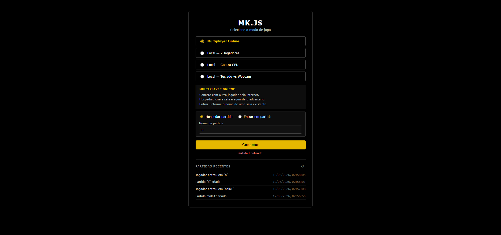

# mk.js

Jogo de luta multiplayer em tempo real, modernizado como projeto individual da disciplina GCES/UnB 2026-1.

**Stack:** Node.js · Express · Socket.IO · PostgreSQL · Docker · Nginx · Kubernetes



---

## Pré-requisitos

- [Docker](https://docs.docker.com/get-docker/) >= 24
- [Node.js](https://nodejs.org/) >= 20 (apenas para rodar testes localmente sem Docker)
- [kubectl](https://kubernetes.io/docs/tasks/tools/) (apenas para validar manifestos K8s)

---

## Desenvolvimento

```bash
docker compose up --build
```

Acesse `http://localhost:55555`.

Hot-reload ativo: alterações em `server/` são refletidas sem reiniciar o container.

---

## Produção

```bash
docker compose -f docker-compose.prod.yml up --build
```

Acesse `http://localhost:80`.

Nginx serve o frontend estático e faz proxy para o backend nas rotas `/api/`, `/health` e `/socket.io/`.

---

## Testes

> Todos os comandos abaixo devem ser executados dentro de `server/`.

```bash
# Testes unitários
cd server && npm test

# Testes de fuzzing (property-based)
cd server && npm run test:fuzz

# Cobertura de testes (gera server/coverage/lcov.info)
cd server && npm run test:coverage
```

---

## Lint e segurança

```bash
# Lint (ESLint + eslint-plugin-security)
cd server && npm run lint

# Auditoria de dependências
cd server && npm audit --audit-level=high
```

---

## Kubernetes (validação local)

```bash
kubectl apply --dry-run=client -f k8s/
```

> Requer um cluster Kubernetes ativo (ex: Docker Desktop com Kubernetes habilitado em Settings → Kubernetes). Sem cluster, o comando retorna erro de conexão — isso é esperado e não indica problema nos manifestos.

---

## Qualidade de código

Análise contínua via SonarCloud: [sonarcloud.io/project/overview?id=Brenofrds_gces-projeto-individual](https://sonarcloud.io/project/overview?id=Brenofrds_gces-projeto-individual)

---

## CI/CD

| Workflow | Gatilho | O que faz |
|---|---|---|
| CI | push / PR na `main` | Build, lint, testes unitários, fuzzing, auditoria SCA, análise SonarCloud |
| CD | push na `main` | Build e publicação das imagens no GHCR |

Pipeline completo visível em **Actions** no GitHub.

---

## Uso de IA

O desenvolvimento foi assistido por IA de forma estruturada. Para isso, foi criada uma pasta local `.ia/` (não versionada) contendo arquivos Markdown organizados por task — cada um com objetivo, escopo, abordagem e critério de aceite — além de um arquivo de contexto geral do projeto e um registro de comandos reutilizáveis. Essa estrutura serviu como base de planejamento e memória entre as sessões de trabalho.

---

## Estrutura do repositório

```
.
├── game/                        # Frontend HTML5 Canvas
├── server/                      # Backend Node.js
│   ├── server.js
│   ├── games.js
│   ├── database.js
│   ├── games.test.js
│   └── games.fuzz.test.js
├── nginx/                       # Configuração Nginx de produção
├── k8s/                         # Manifestos Kubernetes
├── .github/workflows/           # Pipelines CI e CD
├── Dockerfile.dev               # Imagem de desenvolvimento
├── Dockerfile.prod              # Imagem de produção (backend)
├── Dockerfile.nginx             # Imagem de produção (frontend)
├── docker-compose.yml           # Ambiente de desenvolvimento
├── docker-compose.prod.yml      # Ambiente de produção
└── sonar-project.properties     # Configuração SonarCloud
```
